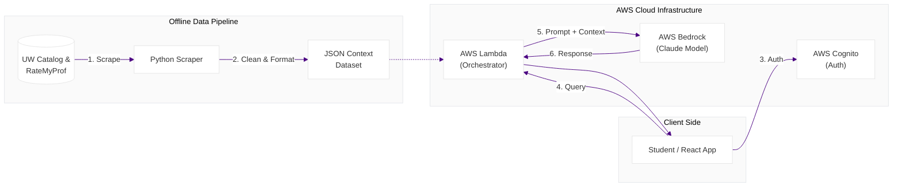

# Husky Track
### AI-Powered Course Navigator & Academic Advisor

Husky Track is an AI-powered academic advisor for University of Washington students. It consolidates course catalog data and professor reviews into a conversational interface, enabling students to make informed decisions about course selection and degree planning.

---

## Motivation

UW students must navigate hundreds of courses, complex prerequisite chains, and information scattered across multiple platforms. Husky Track centralizes this data and supports natural language queries such as:

> *"What CSE course do you recommend based on my recent grades?"*  
> *"When should I take this class to get the highest-rated professor?"*

---

## Security Disclosure

> **Proof of Concept Only**

This repository is intended for design demonstration and architectural reference.

- All sensitive credentials (AWS Access Keys, Bedrock/Anthropic keys) have been removed
- The application will not run locally without valid credentials
- No production secrets are exposed

---

## System Architecture

---

## Architecture

**Offline Data Ingestion** — A custom Python scraper aggregates data from the UW Course Catalog and 1,500+ Rate My Professor reviews, normalizing the output into a structured JSON context file.

**Context Injection** — The full curated dataset is injected directly into the model context at request time, enabling complete curriculum reasoning without a vector database or retrieval pipeline.

**Serverless Backend** — AWS Lambda handles authentication checks, prompt construction, and secure communication with AWS Bedrock.

---

## Tech Stack

| Component        | Technology              | Purpose                          |
|------------------|--------------------------|----------------------------------|
| Frontend         | React, JavaScript        | Student chat interface           |
| Authentication   | AWS Cognito              | Secure user identity             |
| AI Model         | AWS Bedrock (Claude)     | Reasoning and recommendations    |
| Compute          | AWS Lambda               | Serverless request handling      |
| Data Engineering | Python                   | Web scraping and normalization   |

---

## Features

**Course Recommendations** — Filters by prerequisites, difficulty, and professor ratings to suggest appropriate course options.

**Natural Language Interface** — Conversational query support with no manual filtering required.

**Integrated Professor Ratings** — Combines official course descriptions with aggregated student sentiment for holistic recommendations.

---

## Interface Preview

  
  
  

