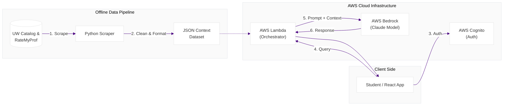

# 🐾 Husky Track  
### *AI-Powered Course Navigator & Academic Advisor*

**Husky Track** is an intelligent academic advisor designed to simplify course planning for **University of Washington students**.  
It transforms complex curriculum data into a **conversational, AI-driven experience**, helping students make informed decisions about classes, professors, and degree paths.

---

## 🎯 Motivation

UW students navigate:
- Hundreds of courses  
- Complex prerequisite chains  
- Fragmented information across catalogs and review sites  

Husky Track unifies this data and lets students ask **natural language questions** like:

> *“What cse course do you recommend based on my recent grades”*  
> *“When should I take this class to get the highest rated professor”*

---

## ⚠️ Security Disclosure

> **Proof of Concept Only**

This repository is intended for **design demonstration and architectural reference**.

- All sensitive credentials (AWS Access Keys, Bedrock / Anthropic keys) have been **removed**
- The application **will not run locally** without valid credentials
- No production secrets are exposed

---

## 🏗️ System Architecture

---

## 🧠 Architecture Highlights

### 📦 Offline Data Ingestion
- Custom Python scraper aggregates:
  - UW Course Catalog
  - 1,500+ Rate My Professor reviews
- Data normalized into a structured **JSON context file**

### 🧩 Context Injection (No Vector DB)
- Entire curated dataset is injected directly into the model context
- Enables full-curriculum reasoning without retrieval pipelines

### ☁️ Serverless Backend
- AWS Lambda orchestrates:
  - Authentication checks
  - Prompt construction
  - Secure communication with AWS Bedrock

---

## 🛠️ Tech Stack

| Component        | Technology              | Purpose |
|------------------|--------------------------|---------|
| Frontend         | React, JavaScript        | Student chat interface |
| Authentication  | AWS Cognito              | Secure user identity |
| AI Model         | AWS Bedrock (Claude)     | Reasoning & recommendations |
| Compute          | AWS Lambda               | Serverless request handling |
| Data Engineering | Python                   | Web scraping & normalization |

---

## 🚀 Key Features

### 🎓 Smart Course Recommendations
- Filters by prerequisites, difficulty, and professor ratings
- Suggests realistic course options

### 💬 Natural Language Search
- Conversational interface
- No manual filtering required

### ⭐ Integrated Professor Ratings
- Merges official descriptions with student sentiment
- Produces holistic recommendations

---

## 📱 Interface Preview

  
  
  

